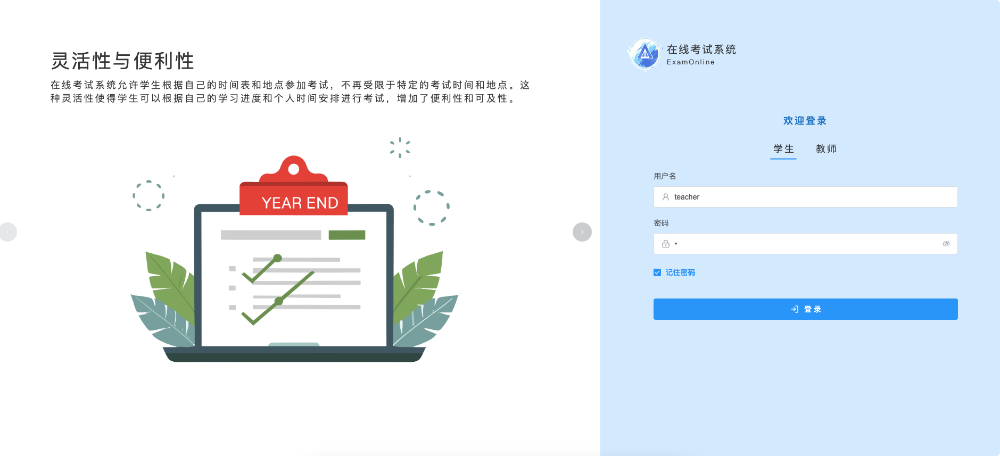
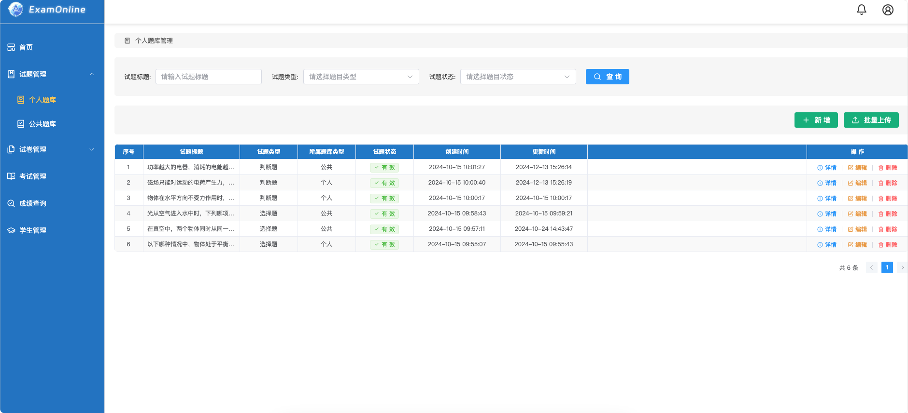
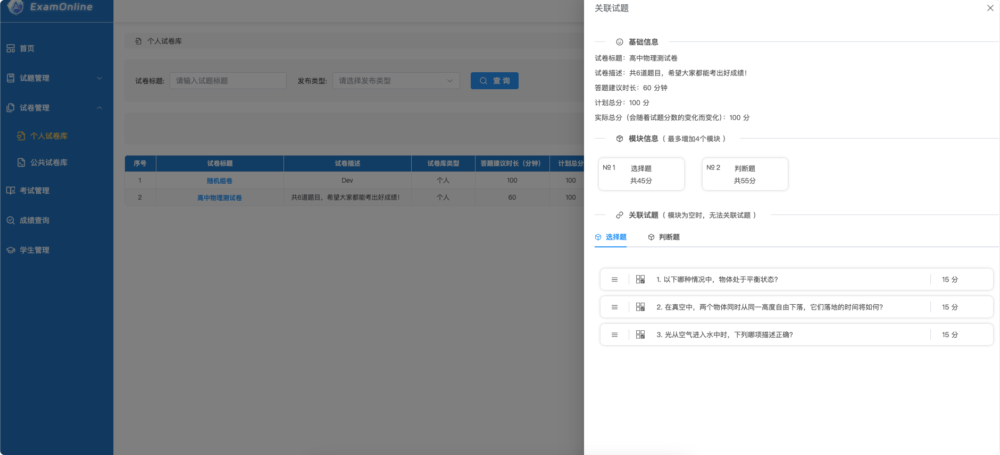
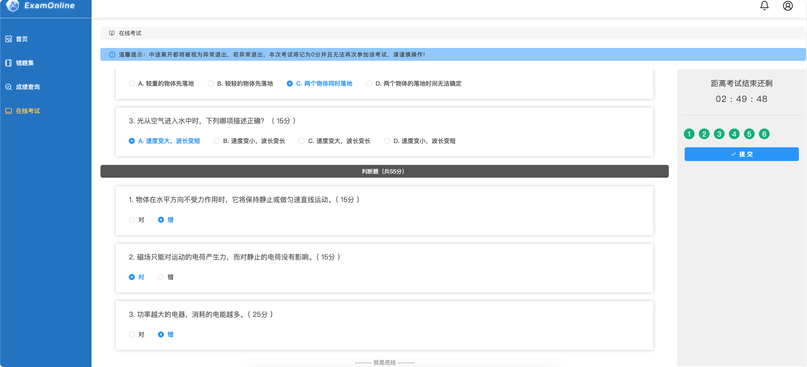
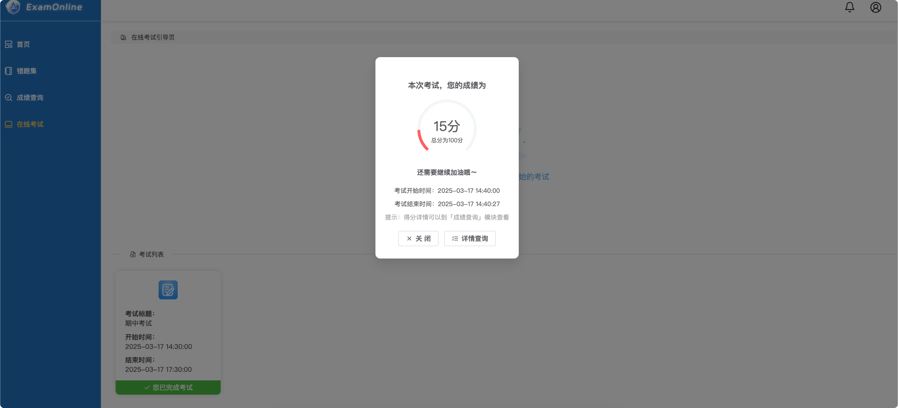
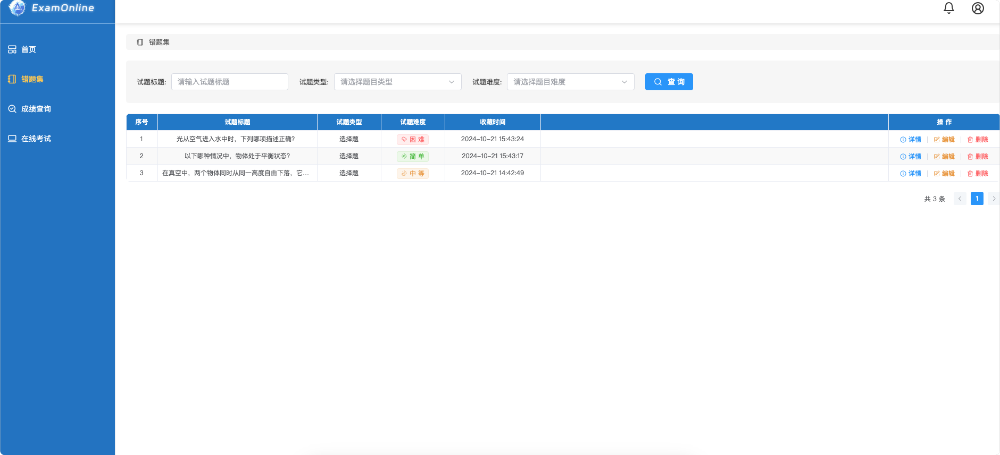

# 智能评分考试系统（后端）

基于 Django 4.2 + Django REST Framework + LangChain 构建的在线考试与智能判分系统后端项目。

---

**功能模块有4大模块：**

`用户管理模块`、`试题管理模块`、`试卷管理模块`和`考试管理模块`

**系统角色有3类：**

`系统管理员`、`学生用户`和`教师用户`

---

#### 技术栈

服务端：Python 3.8 + Django 4.3.8

数据库：MySQL 8.2

---

#### 安装依赖

```bash
pip install -r requirements.txt
```

#### MySQL安装

我是用Docker安装的MySQL，更加方便一些，下面👇是下载&启动命令：  
##### 下载

```bash
docker pull mysql:8.2
```

##### 启动容器  

```bash
docker run -p 3306:3306 --name mysql -e MYSQL_ROOT_PASSWORD=你的密码 -d mysql:8.2
```

##### 创建数据库

例如，数据库名称为：`exam_online`

---

#### 修改配置

数据迁移前，需要修改项目下数据库的配置

位置：`项目目录/ExamOnline/settings.py`，找到👇配置进行修改

```python
DATABASES = {
    'default': {
        'ENGINE': 'django.db.backends.mysql',
        'NAME': '你的数据库名称',
        'USER': 'root',
        'PASSWORD': '你的数据库密码',
        'HOST': '127.0.0.1',
        'PORT': '3306',
        'TIME_ZONE': 'Asia/Shanghai'
    }
}
```

---

#### 数据迁移

配置修改完成后，执行👇的命令

```bash
python manage.py makemigrations
```

```bash
python manage.py migrate
```

数据迁移完成后，检查数据表

#### 导入预制数据

迁移完成后，导入预制`菜单项`、`教师用户`

```bash
python manage.py loaddata initial_data.json
```

⚠️ 注意：导入预制数据前需要先进行migrate。由于预制数据会在开发过程中发生变化，如果更新预制数据，最好先清表，再重新导入。

---

#### 启动项目

预制数据创建完成后，就可以启动项目了

```bash
python manage.py runserver
```

也可以配置Pycharm或是VSCode启动项

---

#### ExamOnline













